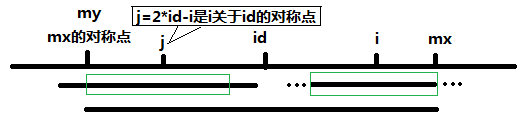

Given a string s, find the longest palindromic substring in s. You may assume that the maximum length of s is 1000.

Example 1:

Input: "babad"
Output: "bab"
Note: "aba" is also a valid answer.

Example 2:

Input: "cbbd"
Output: "bb"

Input: "b"
Output: "b"

解法1，直接枚举每个回文字符串中心字符，然后向两边扩展
Runtime: 23 ms, faster than 79.57% of Java online submissions for Longest Palindromic Substring.
Memory Usage: 38.4 MB, less than 28.63% of Java online submissions for Longest Palindromic Substring.
```java
class Solution {
   public static String longestPalindrome(String s) {
        int len = s.length();
        if(len <= 1){
            return s;
        }
        //记录回文两端位置,以及最长回文两端位置
        int start = 0, end = 0,maxStart = 0, maxEnd = 0;
        //i--中心字符位置
        for (int i = 0; i < len; ++i) {
            //回文字符串为奇数情况
            for(int j = 0; (i - j >= 0) && (i + j < len); ++j) {
                if(s.charAt(i-j) != s.charAt(i+j)) {
                    break;
                }
                start = i - j;
                end = i + j;
            }
            if (end - start >= maxEnd - maxStart) {
                maxStart = start;
                maxEnd = end;
            }
            //回文字符串为偶数情况
            for (int j = 0; (i - j >= 0 ) && (i + j + 1 < len); ++j) {
                if(s.charAt(i-j) != s.charAt(i+j+1)) {
                    break;
                }
                start = i - j;
                end = i + j + 1;
            }
            if (end - start > maxEnd - maxStart) {
                maxStart = start;
                maxEnd = end;
            }
        }
        return s.substring(maxStart, maxEnd+1);
    }
}
```

解法2：Manacher算法 O(n) 时间复杂度

一、在字符和字符间插入特殊符号#，开头和尾也加上，此时字符串长度为奇数

二、用辅助数组p[i] 来表示 以字符s[i]为中心的最长回文字符串的边界（最左边边界或者最右边边界，包括s[i]）

三、用id和mx来表示当前遍历的最长回文字符串中心位置，mx = p[id] + id为其边界

四、条件判定：
if i < mx，找到i关于id的对称点j,则 j = id - (i-id) = 2*id -i,所以有P[i] >= Min(P[2 * id - i], mx - i);

if p[j] < mx - i,说明以j为中心的回文串一定在以id为中心的回文串的内部，且j和i关于位置id对称

由回文串的定义可知，一个回文串反过来还是一个回文串，所以以i为中心的回文串的长度至少和以j为中心的回文串一样，即p[i]>=p[j]。

（又因为i和j的最长回文都小于mx，所以i和j的最长回文一样长，因为id的左右两边完全一样）

因为p[j] < mx - i, 所以 i + p[j] < mx。由对称性可知p[i]=p[j]。

if p[j] >= mx -i,说明以i为中心的回文串可能会延伸到mx之外，而大于mx的部分我们还没有进行匹配

所以要从mx+1位置开始一个一个进行匹配，直到发生失配，从而更新mx和对应的id



if i >= mx , 说明以i为中心的回文字符还没匹配，使p[i] = 1，重新开始匹配

```java

class Solution {
   public static String longestPalindrome(String s) {
        int[] p = new int[2*s.length() + 3];
        int id = 0, mx = 0;
        //加入#分隔符,首尾加入不同符号，防止越界
        String sCopy = "@#" + s.join("#", s.split("")) + "#";
        for (int i = 1; i < sCopy.length()-1; i++) {
            p[i] = i < mx ? Math.min(p[2*id - i], mx - i) : 1;
            while(sCopy.charAt(i-p[i]) == sCopy.charAt(i+p[i])) {
                p[i]++;
            }
            if(i + p[i] >  mx) {
                id = i;
                mx = p[i] + i;
            }
        }
        //寻找出p[i]中最大的
        // int len = 0;
        // int idx = 0;
        // for(int j = 0; j < p.length; j++ ) {
        //     if (p[j] > len) {
        //         len = p[j];
        //         idx = j;
        //     }
        // }
        len = len -1;
        String temp = sCopy.substring(idx - len, idx + len);
        return temp.replace("#","");
    }
}
```

Runtime: 5 ms, faster than 98.51% of Java online submissions for Longest Palindromic Substring.

Memory Usage: 39.6 MB, less than 21.78% of Java online submissions for Longest Palindromic Substring.

```java
class Solution {
public String longestPalindrome(String s) {
        //加入#分隔符,首尾加入不同符号，防止越界
        StringBuilder sb = new StringBuilder("$#");
        for(int i=0;i<s.length();i++){
            sb.append(s.charAt(i)).append("#");
        }
        String temp = sb.toString();
        int mx = 0;
        int id = 0;
        int len = temp.length();
        int [] p = new int[len];
        int maxLen = 0;
        //记录最长的回文字符串中点位置
        int resCenter = 0;
        for(int i = 1;i<len;i++){
            p[i] = mx > i ? Math.min(p[2*id-i],mx-i): 1;
            while(i-p[i]>=0 && i+p[i]<len && temp.charAt(i-p[i]) == temp.charAt(i+p[i])){
                p[i]++;
            }
            if(mx < p[i] + i){
                mx = p[i] + i;
                id = i;
            }
            //寻找出p[i]中最大的
            if(resLen < p[i]){
                maxLen = p[i];
                resCenter = i;
            }
        }
        return s.substring((resCenter-maxLen)/2,(resCenter-maxLen)/2 + maxLen - 1);
    }
}
```
